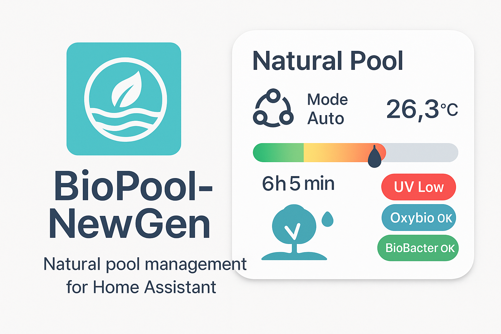

# BioPool-NewGen



**BioPool-NewGen** est une intégration personnalisée Home Assistant permettant la gestion intelligente, automatisée et écologique de piscines biologiques.

Version : `0.3.0-alpha`
Auteur : [@SmanB13](https://github.com/SmanB13)

---

## 🚀 Fonctionnalités principales

- Pilotage multi-mode de la pompe : `auto`, `manual`, `boost`, `frost`, `off`, `ERP`
- Estimation intelligente de la température de l’eau si la sonde est absente
- Suivi précis des consommables : UV, Oxybio, BioBacter
- Mode ERP (conformité horaire minimale réglementaire)
- Optimisation énergétique (solaire, heures creuses)
- Gestion de modes utilisateur : `erp`, `public`, `demo`
- Carte Lovelace interactive avec commandes + visualisation
- Services Home Assistant dédiés : mode, reset, simulation, log
- Historique et durée quotidienne de filtration
- Journalisation HA + notifications persistantes
- Entièrement compatible HACS (custom ou public)

---

## 🔧 Installation via HACS

1. Ajouter ce dépôt GitHub à HACS (type : "Intégration")
2. Installer depuis l’interface HACS
3. Redémarrer Home Assistant
4. Configurer via l’interface UI ou YAML

📦 Requis : Créer une ressource JS dans `Lovelace > Ressources` :
```yaml
url: /local/biopool-newgen-card.js
type: module
```

---

## ⚙️ Entités et capteurs

- `sensor.biopool_status`
  - Attributs : `mode`, `temperature`, `runtime_hours`, `uv_level`, `oxybio_level`, `biobacter_level`
- `sensor.biopool_filtration_runtime_today`
  - Durée cumulée de filtration de la journée

---

## 🧪 Services Home Assistant

- `biopool_newgen.set_mode`: Change le mode actif
- `biopool_newgen.refresh_status`: Force une mise à jour complète
- `biopool_newgen.simulate_demo`: Déclenche des valeurs simulées
- `biopool_newgen.reset_consumables`: Remet à zéro les consommables
- `biopool_newgen.log_message`: Enregistre un message dans le journal

---

## 🖼 Carte Lovelace avancée

```yaml
type: custom:biopool-advanced-card
```

- Mode actuel + commandes
- Température en temps réel
- Jauges UV, Oxybio, BioBacter
- Durée de filtration aujourd’hui

---

## 🧪 Tests et qualité

- Tests unitaires avec `pytest`
- Couverture active via `pytest-cov`
- CI GitHub Actions : `.github/workflows/pytest.yml`

---

## 📄 Ressources disponibles

- `info.md` pour HACS
- `preview.png` / `logo.png`
- `ROADMAP.md` pour suivi de développement
- `automation_refresh_status.yaml` : exemple automation intégrée

---

## 📝 License

MIT License – 2024 [@SmanB13](https://github.com/SmanB13)
